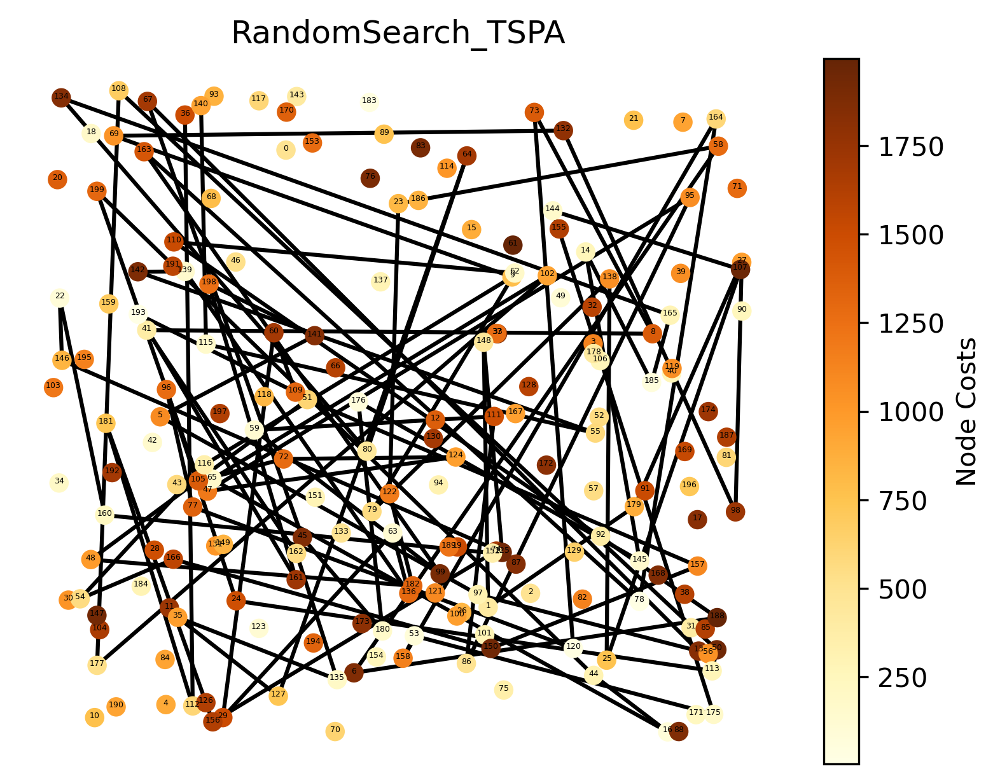
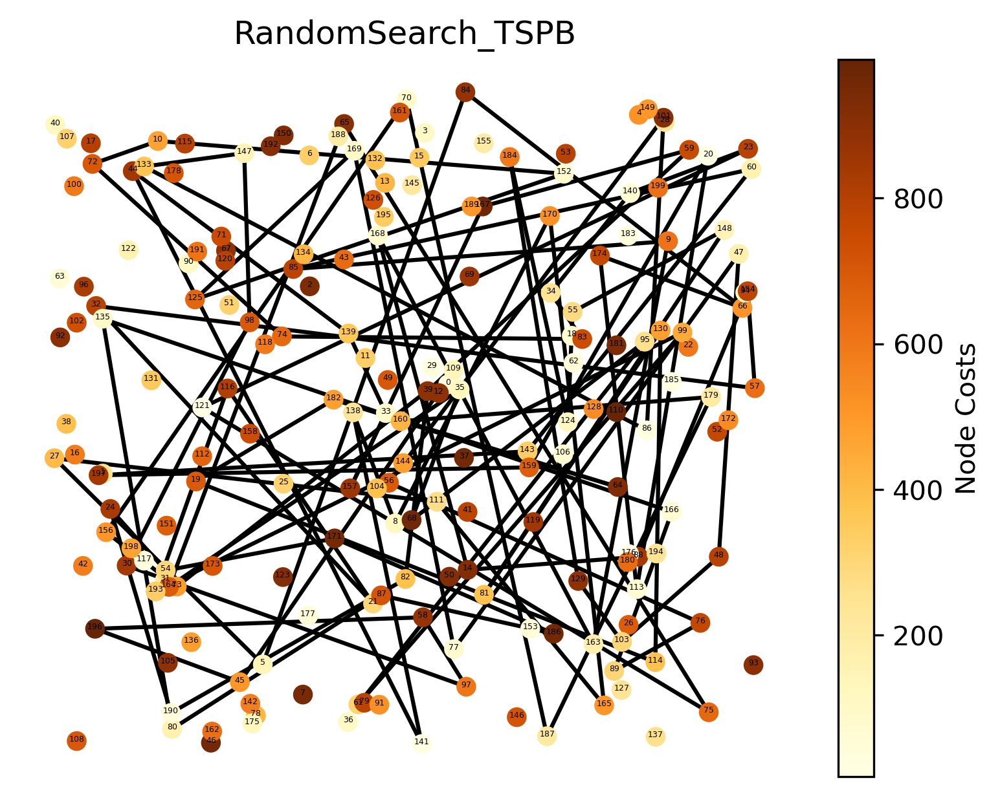
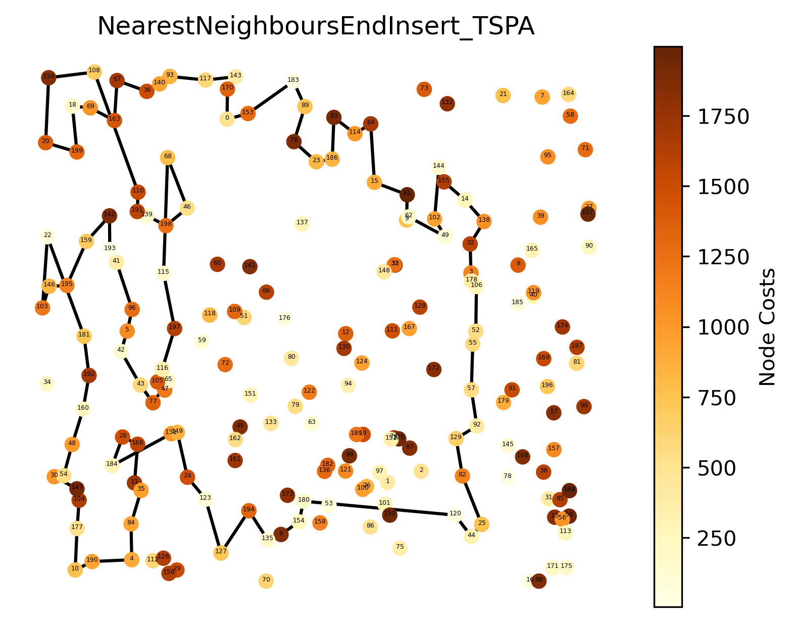
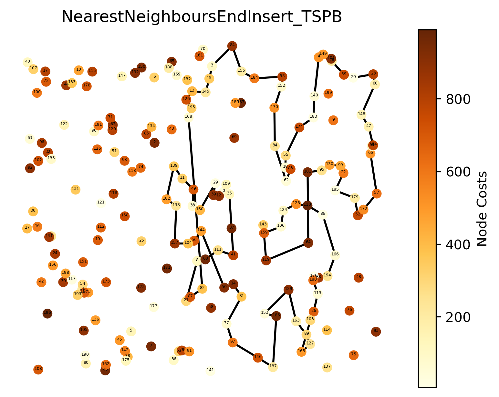
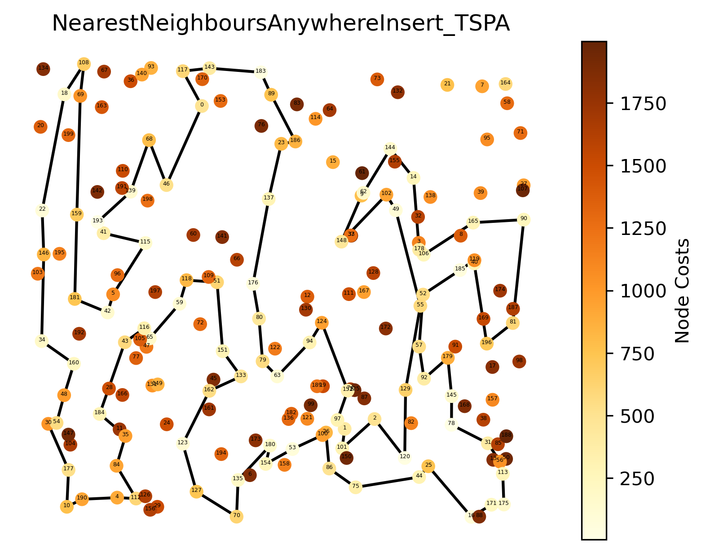
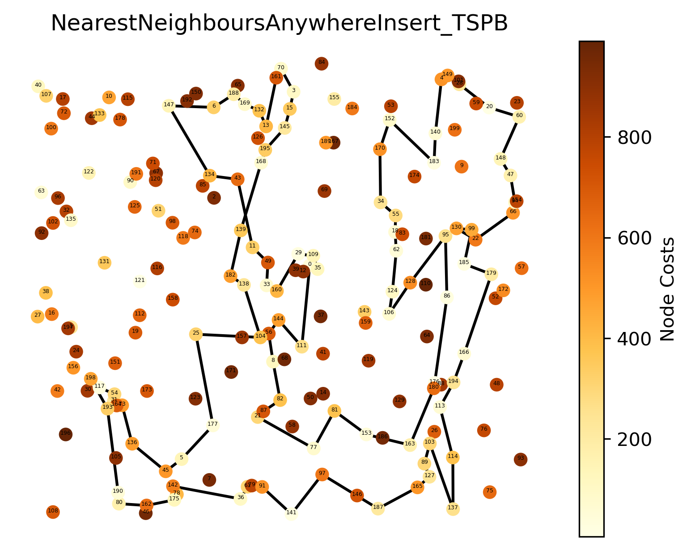
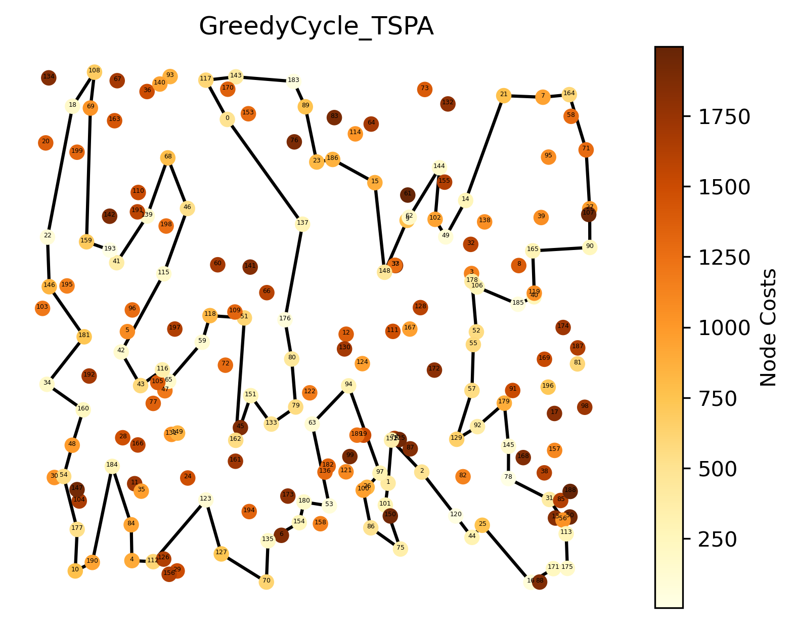
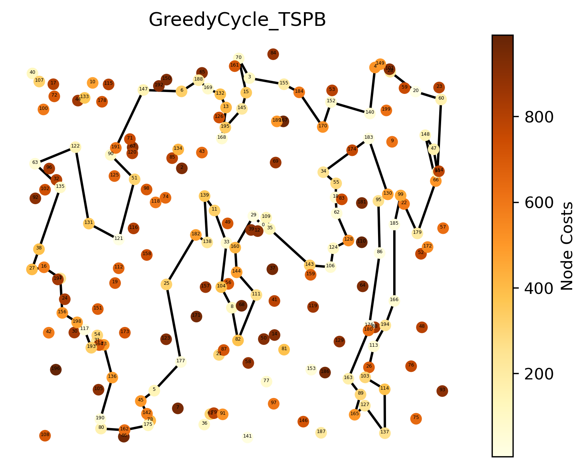

# Solution for Greedy Heuristic Methods

## Problem Description
We are given three columns of integers with a row for each node. The first two columns contain x
and y coordinates of the node positions in a plane. The third column contains node costs. The goal is
to select exactly 50% of the nodes (if the number of nodes is odd we round the number of nodes to
be selected up) and form a Hamiltonian cycle (closed path) through this set of nodes such that the
sum of the total length of the path plus the total cost of the selected nodes is minimized.
The distances between nodes are calculated as Euclidean distances rounded mathematically to
integer values. The distance matrix should be calculated just after reading an instance and then only
the distance matrix (no nodes coordinates) should be accessed by optimization methods to allow
instances defined only by distance matrices.

## Algorithms
### RandomSearch

**pesudocode**

```
ALGORITHM random_search
    INPUT:
        distances, 
        costs, 
        num_nodes, 
        num_solutions

    // perform integer division
    solution_size = (num_nodes + 1) / 2

    total_iterations = num_nodes * num_solutions

    // initialize an array of nodes
    all_nodes = [0 to num_nodes-1]

    FOR i = 0 to num_solutions

        // randomly shuffle the array of nodes
        all_nodes = shuffle_array(all_nodes)

        current_solution = all_nodes[0 to solution_size]

        score = calculate_score(current_solution, distances, costs)

        // update the statistics, store the worst, best and average solution
        update_statistics(score)

    END FOR
END FUNCTION
```
            
<p float="left">

 
</p>

**Best solution for TSPA:**

[1, 179, 27, 98, 132, 69, 9, 116, 54, 166, 150, 157, 51, 48, 182, 122, 23, 58, 6, 188, 110, 62, 79, 138, 25, 107, 144, 175, 53, 158, 164, 78, 163, 99, 59, 111, 86, 95, 47, 124, 72, 105, 199, 44, 16, 65, 102, 177, 108, 50, 113, 24, 96, 77, 120, 73, 8, 41, 162, 135, 35, 127, 64, 80, 134, 165, 185, 14, 145, 176, 180, 45, 67, 13, 97, 5, 141, 198, 161, 193, 109, 60, 29, 63, 136, 139, 142, 55, 115, 140, 36, 112, 181, 156, 152, 160, 22, 146, 125, 148]

**Best solution for TSPB:**

[5, 27, 111, 165, 170, 8, 138, 141, 44, 139, 33, 157, 167, 59, 39, 82, 190, 24, 54, 171, 186, 87, 80, 135, 166, 89, 76, 56, 101, 86, 133, 147, 98, 30, 97, 58, 196, 45, 109, 73, 156, 70, 187, 179, 160, 64, 182, 19, 114, 130, 81, 148, 55, 124, 184, 129, 103, 48, 47, 77, 169, 125, 152, 10, 72, 74, 83, 34, 140, 23, 121, 75, 65, 164, 35, 68, 95, 61, 99, 193, 116, 21, 32, 57, 154, 88, 14, 168, 163, 9, 85, 60, 143, 197, 159, 20, 113, 174, 66, 84]

### NearestNeighboursEndInsert

**pesudocode**

```
FUNCTION NearestNeighboursEndInsert(distances, costs, num_nodes, num_solutions)

    // perform integer division
    solution_size = (num_nodes + 1) / 2

    total_iterations = num_nodes * num_solutions

    // initialize an array of nodes
    all_nodes = [0 to num_nodes-1]

    // for each node as starting point
    FOR start_node = 0 to num_nodes
        // generate num_solutions starting from this node
        FOR i = 0 to num_solutions

            current_solution = []

            visited = [false for num_nodes]
            visited[start_node] = true

            WHILE size(current_solution) < solution_size
                last_node = current_solution[-1]
                nearest_nodes = []
                num_nearest = 0
                min_distance = infinity

                FOR j = 0 to num_nodes
                    IF not visited[j]
                        distance = distances[last_node][j]
                        IF distance < min_distance
                            num_nearest = 1
                            nearest_nodes[-1] = j
                        ELSE IF distance == min_distance
                            num_nearest += 1
                            nearest_nodes[-1] = j
                        END IF
                    END IF
                END FOR

                IF num_nearest == 0
                    DO BREAK
                END IF

                // randomly select one of the nearest nodes
                rand_index = rand % num_nearest
                nearest_node = nearest_nodes[rand_index]
                current_solution[-1] = nearest_node
                visited[nearest_node] = true

            END WHILE

        score = calculate_score(current_solution, distances, costs)
        // update the statistics, store the worst, best and average solution
        update_statistics(score)
        END FOR
    END FOR

END FUNCTION
```
            
<p float="left">

 
</p>

**Best solution for TSPA:**

[0, 170, 143, 117, 93, 140, 36, 67, 163, 69, 18, 199, 20, 134, 108, 110, 191, 139, 198, 46, 68, 115, 197, 116, 105, 47, 65, 77, 43, 42, 5, 96, 41, 193, 142, 159, 195, 146, 103, 22, 181, 192, 160, 48, 54, 30, 147, 104, 177, 10, 190, 4, 84, 35, 11, 166, 28, 184, 131, 149, 24, 123, 127, 194, 135, 6, 154, 180, 120, 44, 25, 82, 129, 92, 57, 55, 52, 106, 178, 3, 32, 138, 14, 155, 144, 102, 49, 62, 9, 61, 15, 64, 114, 83, 186, 23, 76, 89, 183, 153]

**Best solution for TSPB:**

[0, 109, 12, 39, 29, 160, 33, 49, 11, 139, 182, 138, 157, 104, 56, 144, 50, 14, 81, 77, 97, 146, 187, 186, 153, 129, 163, 89, 127, 165, 103, 26, 113, 180, 176, 88, 194, 166, 86, 110, 128, 124, 106, 159, 143, 119, 64, 181, 95, 130, 99, 22, 185, 179, 52, 172, 57, 66, 94, 154, 47, 148, 60, 23, 20, 59, 28, 101, 149, 4, 140, 183, 174, 55, 18, 83, 62, 34, 170, 152, 53, 184, 155, 84, 3, 15, 145, 13, 126, 195, 168, 82, 87, 21, 8, 68, 111, 41, 37, 35]

### NearestNeighboursAnywhereInsert

**pesudocode**

```

FUNCTION NearestNeighboursAnywhereInsert(distances, costs, num_nodes, num_solutions)

    // perform integer division
    solution_size = (num_nodes + 1) / 2

    total_iterations = num_nodes * num_solutions

    // initialize an array of nodes
    all_nodes = [0 to num_nodes-1]

    // for each node as starting point
    FOR start_node = 0 to num_nodes
        // generate num_solutions starting from this node
        FOR i = 0 to num_solutions

            current_solution = []

            visited = [false for num_nodes]
            visited[start_node] = true

            WHILE size(current_solution) < solution_size
                best_nodes = []
                best_positions = []
                num_best = 0
                min_increase = infinity

                FOR j = 0 to num_nodes
                    IF not visited[j]
                        FOR pos = 0 TO count DO
                            // Determine the previous and next nodes based on position
                            IF pos == 0 THEN // Last node in the current solution
                                prev_node = current_solution[count - 1]  
                            ELSE // Node before thecurrent position
                                prev_node = current_solution[pos - 1]     
                            END IF

                            IF pos == count THEN // First node in the current solution
                                next_node = current_solution[0] 
                            ELSE // Current node
                                next_node = current_solution[pos]           
                            END IF

                            // Calculate the increase in cost for inserting node j
                            increase = distances[prev_node][j] + distances[j][next_node] - distances[prev_node][next_node] + costs[j]

                            // Check if this increase is the minimum found so far
                            IF increase < min_increase THEN
                                min_increase = increase
                                num_best = 1                               // Reset best count
                                best_nodes[0] = j                          // Store the best node
                                best_positions[0] = pos                    // Store the position for the best node
                            ELSE IF increase == min_increase THEN
                                best_nodes[num_best] = j                   // Store the node for equal increase
                                best_positions[num_best] = pos             // Store the position for equal increase
                                num_best = num_best + 1                    // Increment the count of best nodes
                            END IF
                        END FOR

                    END IF
                END FOR

                IF num_nearest == 0
                    DO BREAK
                END IF

                // randomly select one of the nearest nodes
                rand_index = rand % num_best
                best_node = best_nodes[rand_index]
                best_posiition = best_positions[rand_index]
                
                // insert the best_node at best_position
                FOR m = size(current_solution) to best_position decreasing
                    current_solution[m] = current_solution[m-1]
                END FOR
                current_solution[best_position] = best_node

                visited[bst_node] = true

            END WHILE
            
        score = calculate_score(current_solution, distances, costs)
        // update the statistics, store the worst, best and average solution
        update_statistics(score)
        END FOR
    END FOR

END FUNCTION

```
            
<p float="left">

 
</p>

**Best solution for TSPA:**

[0, 117, 143, 183, 89, 186, 23, 137, 176, 80, 79, 63, 94, 124, 152, 97, 1, 101, 2, 120, 129, 55, 49, 102, 148, 9, 62, 144, 14, 178, 106, 165, 90, 81, 196, 40, 119, 185, 52, 57, 92, 179, 145, 78, 31, 56, 113, 175, 171, 16, 25, 44, 75, 86, 26, 100, 53, 154, 180, 135, 70, 127, 123, 162, 133, 151, 51, 118, 59, 65, 116, 43, 184, 35, 84, 112, 4, 190, 10, 177, 30, 54, 48, 160, 34, 146, 22, 18, 108, 69, 159, 181, 42, 5, 115, 41, 193, 139, 68, 46]

**Best solution for TSPB:**

[0, 35, 109, 29, 160, 33, 49, 11, 43, 134, 147, 6, 188, 169, 132, 13, 161, 70, 3, 15, 145, 195, 168, 139, 182, 138, 104, 25, 177, 5, 45, 136, 73, 164, 31, 54, 117, 198, 193, 190, 80, 162, 175, 78, 142, 36, 61, 91, 141, 97, 187, 165, 127, 89, 103, 137, 114, 113, 194, 166, 179, 185, 99, 130, 22, 66, 94, 47, 148, 60, 20, 28, 149, 4, 140, 183, 152, 170, 34, 55, 18, 62, 124, 106, 128, 95, 86, 176, 180, 163, 153, 81, 77, 21, 87, 82, 8, 56, 144, 111]

### GreedyCycle

**pesudocode**

```
FUNCTION NearestNeighboursEndInsert(distances, costs, num_nodes, num_solutions)

    // perform integer division
    solution_size = (num_nodes + 1) / 2

    total_iterations = num_nodes * num_solutions

    // initialize an array of nodes
    all_nodes = [0 to num_nodes-1]

    // for each node as starting point
    FOR start_node = 0 to num_nodes
        // generate num_solutions starting from this node
        FOR i = 0 to num_solutions

            current_solution = []
            visited = [false for num_nodes]

            current_solution[-1] = start_node
            visited[start_node] = true
            // FIXME: why the farthest??
            // Find the farthest node to start forming a cycle
            farthest_nodes = []
            num_farthest = 0
            max_distance = -1

            FOR j = 0 to num_nodes
                IF NOT visited[j]
                    distance = distances[start_node][j]
                    IF distance > max_distance
                        farthest_nodes[-1] = j
                        num_farthest = 0
                    ELSE IF distance == max_distance
                        farthest_nodes[-1] = j
                        num_farthest += 1
                    END IF
                END IF
            END FOR

            IF num_farthest == 0
                continue
            END IF

            // randomly select one of the farthest nodes
            rand_index = rand % num_farthest
            farthest_node = farthest_nodes[rand_index]
            visited[farthest_node] = true

            WHILE size(current_solution) < solution_size
                best_nodes = []
                best_positions = []
                num_best = 0
                min_increase = infinity

                FOR j = 0 to num_nodes
                    IF NOT visited[j]

                    END IF

                END FOR

            END WHILE


        score = calculate_score(current_solution, distances, costs)
        // update the statistics, store the worst, best and average solution
        update_statistics(score)
        END FOR
    END FOR

END FUNCTION
```
            
<p float="left">

 
</p>

**Best solution for TSPA:**

[0, 137, 176, 80, 79, 133, 151, 162, 51, 118, 59, 65, 116, 43, 42, 115, 46, 68, 139, 41, 193, 159, 69, 108, 18, 22, 146, 181, 34, 160, 48, 54, 177, 10, 190, 184, 84, 4, 112, 123, 127, 70, 135, 154, 180, 53, 63, 94, 97, 26, 100, 86, 75, 101, 1, 152, 2, 120, 44, 25, 16, 171, 175, 113, 56, 31, 78, 145, 179, 92, 129, 57, 55, 52, 178, 106, 185, 40, 119, 165, 90, 27, 71, 164, 7, 21, 14, 49, 102, 144, 62, 9, 148, 15, 186, 23, 89, 183, 143, 117]

**Best solution for TSPB:**

[0, 29, 160, 144, 111, 82, 8, 104, 33, 11, 139, 138, 182, 25, 177, 5, 45, 142, 78, 175, 162, 80, 190, 136, 73, 54, 31, 193, 117, 198, 156, 1, 16, 27, 38, 135, 63, 122, 131, 121, 51, 90, 191, 147, 6, 188, 169, 132, 13, 168, 195, 145, 15, 70, 3, 155, 184, 170, 152, 140, 4, 149, 28, 20, 60, 94, 47, 148, 66, 179, 22, 99, 185, 166, 194, 113, 26, 103, 114, 137, 127, 165, 89, 163, 180, 176, 86, 95, 130, 183, 34, 55, 18, 62, 128, 124, 106, 143, 35, 109]


## Results
| Algorithm                       | Dataset   |   worst |      avg |   best |
|:--------------------------------|:----------|--------:|---------:|-------:|
| RandomSearch                    | TSPA      |  297114 | 264629   | 240955 |
| RandomSearch                    | TSPB      |  240235 | 213118   | 189662 |
| NearestNeighboursEndInsert      | TSPA      |  121258 | 114530   | 107944 |
| NearestNeighboursEndInsert      | TSPB      |   72432 |  67115.2 |  60076 |
| NearestNeighboursAnywhereInsert | TSPA      |   74410 |  72601.9 |  71488 |
| NearestNeighboursAnywhereInsert | TSPB      |   57324 |  51346.6 |  48765 |
| GreedyCycle                     | TSPA      |   74949 |  72561.6 |  70538 |
| GreedyCycle                     | TSPB      |   53246 |  49806   |  46713 |


# Remarks

For each experiment we also check whether the solution is a valid hamiltonian cycle.